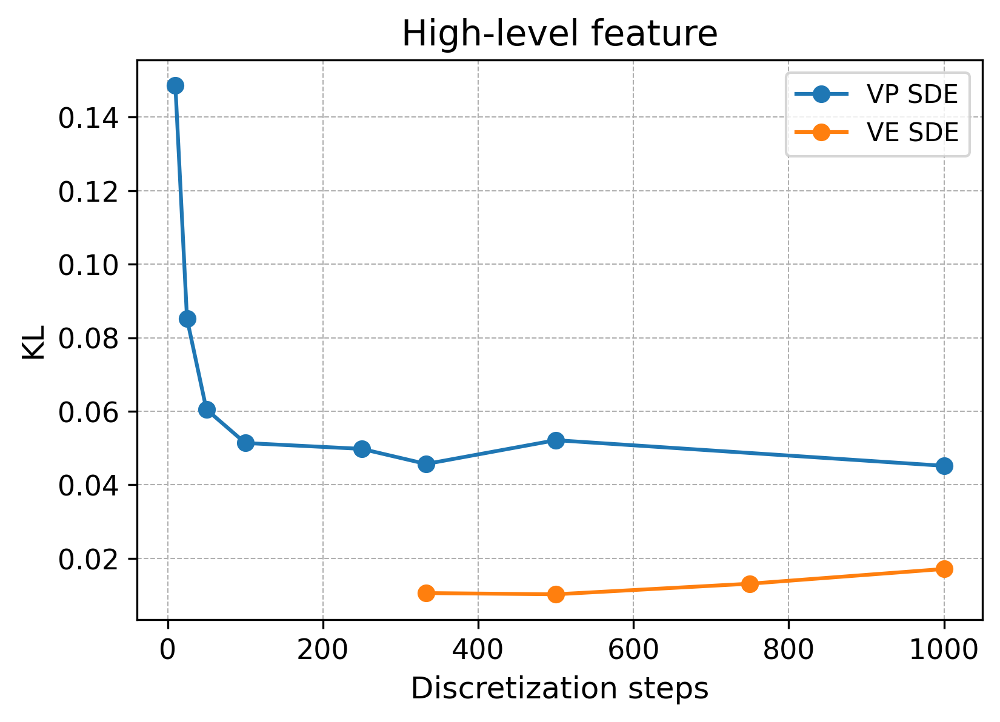
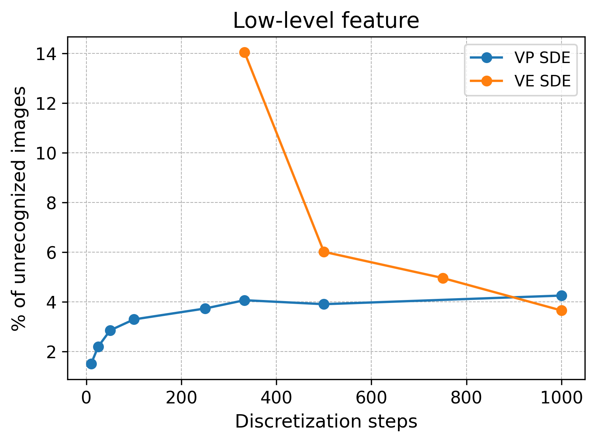

# Code for Optimizing Noise Schedules of Generative Models in High Dimensionss
This is the official repo for the experiments from the paper [Optimizing Noise Schedules of Generative Models in High Dimensionss](https://arxiv.org/abs/2501.00988) by S. Aranguri, G. Biroli, M. Mezard, E. Vanden-Eijnden (under review).

## Generating samples from a Gaussian mixture and Curie-Weiss distributions using exact velocity field
In the `exact_models` folder, we implemented a flow-based model to generate samples from a Gaussian mixture and the Curie-Weiss distributions using both the Variance Preserving (VP) and Variance Exploding (VE) schedules. Since this data distributions are simple, the velocity field can be obtained exactly. This is used to numerically verify and illustrate the claims in the paper.

## Comparing VP and VE schedules using CelebA dataset
In the `celeba_task` folder, we provide the code to generate samples using the VP and VE SDEs from Song et al 2020 [2] pre-trained on the CelebA-HQ dataset, with different number of discretization steps (under `celeba_task/run_vp.py` and `celeba_task/run_ve.py`). We then run a discriminator to measure the quality of the high- and low-level features on the generated images  (under `celeba_task/run_high.py` and `celeba_task/run_low.py`.) Finally, the code at `celeba_task/present_high.ipynb` and `celeba_task/present_low.ipynb` is used to make the following plots 

  
  

We then see that the VE schedule outperforms the VP in the high-level aspects while this is reversed (when using a small number of steps) for the quality of the details of the generated image (see more details in the paper.)

## Initial experiments on CIFAR dataset
In the `cifar` folder, we forked and modified Song et al 2020 [2] implementation of score-based diffusion models for the CIFAR dataset for some quick experiments on different noise schedules (since CIFAR is much lighter than the CelebA dataset) in the beginning of the project. Note, however, that the final paper does not contain experiments with CIFAR.

## References
[1] Aranguri, S., Biroli, G., Mezard, M., & Vanden-Eijnden, E. (2025) Optimizing Noise Schedules of Generative Models in High Dimensionss. arXiv preprint arXiv:2501.00988.
[2] Song, Y., Sohl-Dickstein, J., Kingma, D. P., Kumar, A., Ermon, S., & Poole, B. (2020). Score-based generative modeling through stochastic differential equations. arXiv preprint arXiv:2011.13456.
